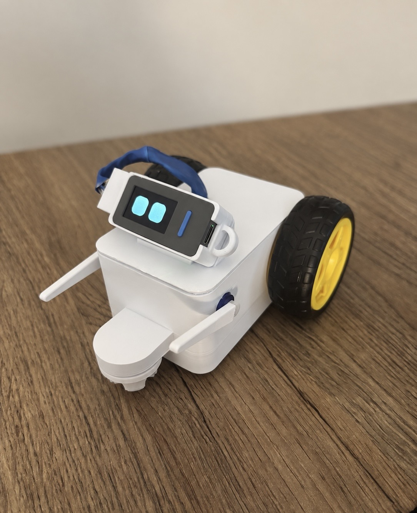
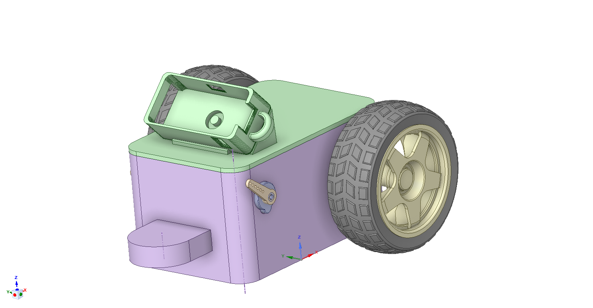

# Gövde — 3B baskı parçaları

**Gövde artık var ve basılabiliyor.** Bu klasör, Pati'yi kendi yapmak
isteyen biri için gereken bütün parçaları taşıyor: dilimleyiciye
doğrudan verilebilen STL'ler ve tasarımı değiştirmek isteyenler için
düzenlenebilir CAD kaynağı.

<p align="center">
  
  
</p>

---

## Ne nerede

### `print/` — dilimleyiciye doğrudan verilir

| Dosya | Ne |
|---|---|
| `body.stl` | Gövdenin kendisi. Motorlar, sürücü ve besleme bunun içinde |
| `body-top.stl` | Üst kapak. StickS3 yuvası bunun üzerinde |
| `arm.stl` | Kol. **İki adet basılıyor** — servo boynuzuna geçiyor |
| `sticks3-case.stl` | StickS3'ün kızağa oturan kasası |
| `sticks3-cable-plug.stl` | Hat2-Bus şerit kablosunu Stick'e hizalayan tutucu |

### `cad/` — tasarımı değiştirmek için

Üçü de **aynı montajın** farklı biçimleri:

| Dosya | Ne zaman |
|---|---|
| `pati-assembly.step` | **Önce bunu dene.** Her CAD programı okuyor |
| `pati-assembly.x_t` | Parasolid çekirdekli programlarda (SolidWorks, Solid Edge, NX) daha temiz geliyor |
| `pati-assembly.scdocx` | SpaceClaim'in kendi biçimi — tasarım ağacıyla birlikte |

⚠️ **STL'i düzenlemeye çalışma.** STL yalnızca üçgen yüzeyler tutuyor;
ölçüyü 2 mm büyütmek gibi bir şey orada ağrılı, CAD kaynağında bir
sayı. Değişiklik `cad/`'de yapılıp STL yeniden dışa aktarılmalı.

---

## 🔴 Ön tekerlekler DÖNEBİLEN (caster) olmalı — bu ölçülmüş bir ders

Gövdede dört tekerlek var: arkada iki tahrik tekerleği, önde iki
destek. **Öndekiler sabit akslı olursa Pati kendi etrafında dönerken
İLERİ KAYIYOR.**

Sebep mekanik: sabit bir tekerlek kendi ekseninde dirençsiz yuvarlanıp
yana kaymaya direniyor, yani gövdeyi bir rayın üstüne koyuyor. Dönüşe
çevrilemeyen kuvvet, direnç görmediği tek eksene — ileri — kaçıyor.

⚠️ **Bu yazılımdan düzeltilemiyor ve üç sürüm boyunca denendi.** Pati'nin
jest tablosunda net dönüş yapısal olarak sıfır (iki tekerlek her zaman
ters yönde) ve konak testi bunu her girdide tarıyor — yani komut zaten
doğruydu, kayan şey fizikti. Ön tekerlekler dönebilen (İngilizcesi
*caster*, Türkçede "sarhoş teker") tipiyle değiştirilince kayma bitti
(13.09.2026). Ayrıntı: [`../firmware/BEDEN.md`](../firmware/BEDEN.md).

**Neden önemli:** Pati'de uçurum sensörü yok. Kendi kararıyla ilerleyen
bir robot eninde sonunda masadan düşer, ve bu tasarımın tamamı Pati'nin
yalnızca *yerinde dönmesi* üzerine kurulu.

---

## Baskı dışında gereken parçalar

| Parça | Not |
|---|---|
| 2 × TT redüktörlü DC motor + tekerlek | sarı, yaygın tip |
| 2 × dönebilen (caster) ön tekerlek | yukarıdaki bölüm |
| 1 × L9110S çift kanal motor sürücü | |
| 2 × SG90 sınıfı mini servo | kollar |
| Besleme | 4'lü AA yuvası **ya da** powerbank |
| M5Stack StickS3 (SKU K150) | Pati'nin kendisi |

🔴 **Motor ve servo beslemesi StickS3'ten ALINMIYOR.** Gövdeden Stick'e
giden sekiz kablonun hepsi ya toprak ya Stick'in kendi çıkışı; 6 V
hattı gövdenin içinde kalıyor. Bu bir uyarı değil, **pin seçiminin
sebebi**: kural böyle kurulunca yanlış pine kayan bir kablonun en kötü
sonucu "motor sürekli dönüyor" oluyor, yanmış bir kart değil.

Kablo şeması ve pin tablosu:
[`../firmware/BEDEN.md`](../firmware/BEDEN.md) ·
[`../firmware/Pati_Tek_Bakis_Kablolama_Diyagrami.png`](../firmware/Pati_Tek_Bakis_Kablolama_Diyagrami.png)

---

## Monte ederken

🔴 **Kolun gidebileceği aralık MEKANİK bir sınır.** Bu gövdede ölçüldü
(09.09.2026): sol kol **%10–%70**, sağ kol **%0–%100**. Sol kol aşağıda
tekerleğe, yukarıda üstteki kabloya çarpıyor. Aşılırsa kol dayanır,
servo dönmeye çalışıp durur, ısınır ve **yanar** — belirtisi sürekli
bir vızıltıdır.

Aralık panelden ayarlanıyor ve **fabrika ayarlarına dönünce
silinmiyor**; kaybolması donanıma zarar verdiği için ayrı bir flash
bölümünde duruyor.

⚠️ **Servolar ters takılabilir** ve ikinci gövdede öyle oldu.
"Kolunu kaldır" deyince kol aşağı iniyorsa panelde **"Kol yönünü ters
çevir"** anahtarı var. Aynısı sürüş için de var: joystick'i ileri
itince Pati geri gidiyorsa **"İleri/geri yönünü ters çevir"**, sağa
itince sola dönüyorsa **"Sağ/sol yönünü ters çevir"**. Üçü birbirinden
bağımsız.

⚠️ **Mikrofon, hoparlör ve USB-C deliği kapatılmamalı.** Üçü de
Stick'in gövdesinde. Hoparlör 1 W ve zaten kısık; önüne konan her
katman daha da kısıyor ve **yazılımdan telafi edilemiyor** (ses tavanı
pil yüzünden sınırlı — [`../firmware/PIL.md`](../firmware/PIL.md)).
USB-C hem şarj hem de bir şey ters giderse tek kurtarma yolu.

⚠️ **Metal kasalı powerbank'i Stick'in altına koyarken dikkat.**
Ölçülen wifi sinyali −76…−91 dBm ve zayıf sinyal brownout'un bilinen
bir etkeni. Henüz doğrulanmadı ama şüphe, powerbank'in ve Stick'in
üstünden geçen şerit kablonun anteni gölgelemesi.

---

## Henüz yazılmamış olanlar

**Tahmin değil ölçüm** kuralı burada da geçerli — bu sayılar
ölçülmediği için yazılmadı, uydurulmadı:

- Katman yüksekliği, doluluk oranı, destek gerekip gerekmediği
- Filament cinsi (fotoğraftaki baskı beyaz, cinsi kayıtlı değil)
- Baskı süresi ve malzeme miktarı
- Vida ölçüleri

Basan biri bunları ölçerse buraya eklenmeli.

---

## Eski gövde

Ağustos 2026'ya kadar Pati elle lehimlenmiş bir ESP32-S3 devkit'ti ve
onun da kendi kabuğu vardı — iki parçalı bir kafa, bir gövde, bir
taban. O donanım emekli oldu ve parçalar onunla birlikte arşivde:

```
git switch --detach v2.2.8-devkit
ls enclosure/
```

Silinmediler; buradan kaldırılmalarının tek sebebi yanıltıcı olmaları.
Ölçüleri artık var olmayan bir cihaza ait.

M5Stack StickS3'ün kendi CAD dosyaları da yayımlanmış durumda — kasayı
sıfırdan çizmek gerekirse tahmin etmeye gerek yok:

<https://github.com/m5stack/M5_Hardware/tree/master/Products/K150_StickS3/Structures>
